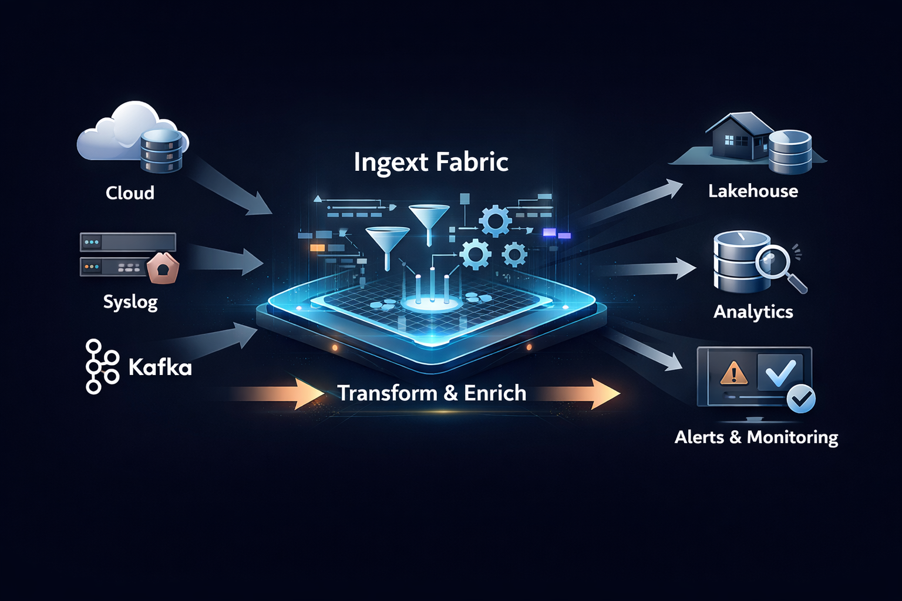
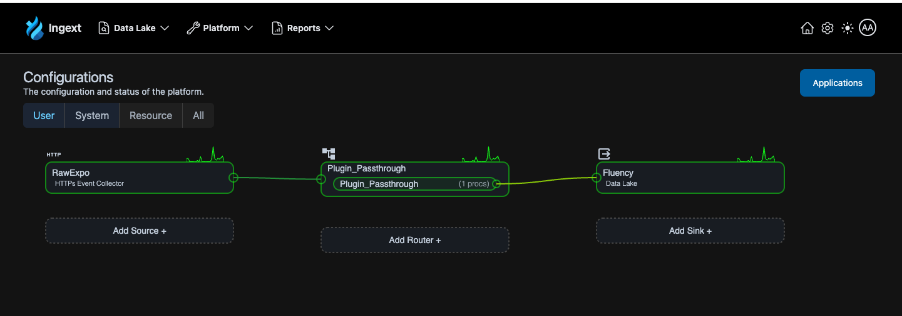
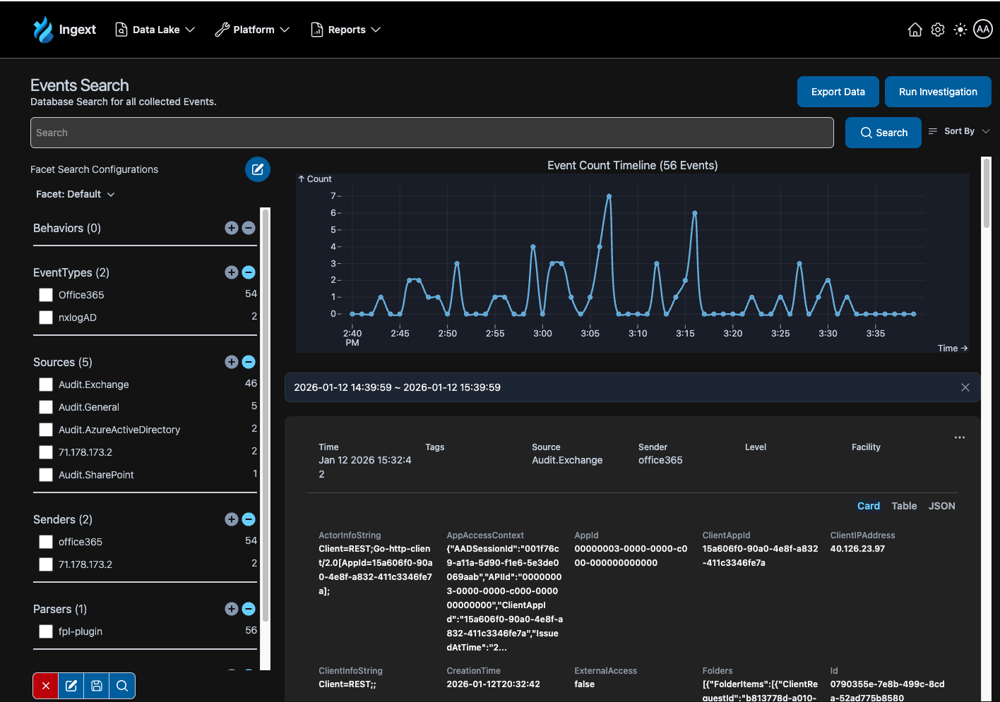

# Ingext: The Self-Hosted Data Fabric & Lakehouse 🚀

Ingext is a high-performance, self-hosted data fabric designed to solve the hardest part of data systems: **clean collection, transformation, and routing *before* storage.**

## Why Try Ingext?

If you’ve struggled with:
- **Rising data storage costs** from uncompressed or redundant data.
- **Brittle ingestion pipelines** that break on schema changes.
- **Inconsistent data** across your lakes and analytics platforms.
- **The "Storage First" Trap**: Realizing you need to re-process terabytes of data after it's already stored.

Ingext lets you build a "Schema-on-Write" fabric that cleans, enriches, and routes data in real-time, ensuring your lakehouse only stores high-value, curated data.

---

## 🚀 Fastest Way to Try Ingext (Recommended)

If your goal is to see Ingext in action without manually configuring Kubernetes internals, use our **Unified Lakehouse Installers**. These automate infrastructure, storage, ingress, and TLS.

| Cloud | Installer Path | Description |
| :--- | :--- | :--- |
| **AWS** | [`lakehouse-aws/`](lakehouse-aws/README.md) | EKS + S3 + Karpenter + ALB |
| **Azure** | [`lakehouse-azure/`](lakehouse-azure/README.md) | AKS + Blob + App Gateway |
| **GCP** | [`ingext-gke-helper/`](ingext-gke-helper/README.md) | GKE + GCS + Cloud Load Balancer |

---

## What Success Looks Like

After completing the 30-60 minute deployment, you will have:

1.  **Management Console**: A beautiful UI to manage your pipes, parsers, and dashboards.
2.  **Live Data Fabric**: A system capable of ingestion from HTTP, Syslog, Kafka, and more.
3.  **Curated Datalake**: Data automatically organized and stored in S3/Blob/GCS.
4.  **Real-time Routing**: The ability to send data once and route it to multiple destinations simultaneously.

### Data Fabric Configuration

### Data Lake Search

---

## Documentation & Learning

This README focuses on deployment. For building and using Ingext, visit our [Official Documentation](https://ingext.readme.io/docs/quick-start-guide):

- [Quick Start Guide](https://ingext.readme.io/docs/quick-start-guide) (Your first pipeline)
- [Fluency Processing Language (FPL)](https://ingext.readme.io/docs/fluency-processing-language)
- [Data Sources & Sinks](https://ingext.readme.io/docs/adding-a-data-source)
- [Parsers & Transformations](https://ingext.readme.io/docs/creating-a-processor)

---

## First Steps After Login

1.  **Access the Console**: Navigate to your configured domain.
2.  **Login**:
    - **User**: `admin@ingext.io`
    - **Password**: `ingext`
    > **Note**: These are for initial testing only. Change your password immediately in the settings.
3.  **Create a Pipe**: Follow the [Quick Start](https://ingext.readme.io/docs/quick-start-guide) to create your first streaming pipeline.
4.  **Verify Flow**: Send a test event and watch it appear in the real-time stream and your datalake.

---

## Who Is This For?

-   **Platform & Data Engineers** who want to regain control over ingestion.
-   **Security Teams** needing real-time log normalization and routing.
-   **Architects** evaluating self-hosted, scalable lakehouse alternatives.
-   **Performance Freaks** who need to process millions of events per second with minimal overhead.

---

## ⚙️ Advanced: Manual Installation

If you prefer to customize every component or deploy to an existing cluster, please refer to the [Technical_README.md](Technical_README.md).

---

## Time & Cost Expectations

-   **Deployment Time**: 30–60 minutes (mostly waiting for cloud resources).
-   **Cloud Costs**: Minimal during trial (approx. $2-5/day depending on cluster size).
-   **Cleanup**: Use the provided `cleanup-lakehouse.sh` scripts in each cloud directory to delete all resources and stop billing.

---

## Support

If you encounter issues during installation or have questions about Ingext, please:
- Open an [Issue](https://github.com/ingext/ingext-community/issues)
- Visit [ingext.io](https://ingext.io)
